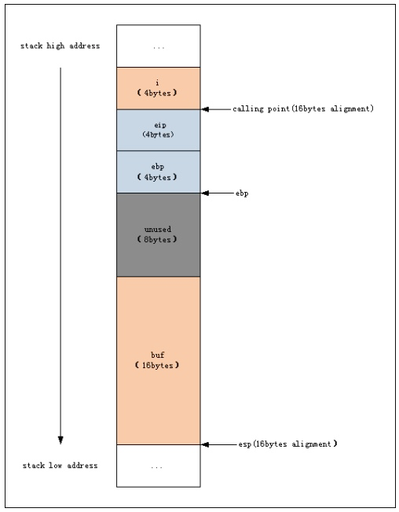

Title: GCC内存栈对齐的坑
Date: 2016-11-04 03:43
Author: jmpews
Category: pwn
Tags: gdb, stack
Slug: align-gcc-stack

## 简介
源于《深入理解计算机操作系统》的P153页的内存栈对齐.

## 什么是内存对齐
---
函数运行时需要的栈的大小是确定的, 比如经常会遇到如下的代码.

```
pushl %ebp
movl %esp, %ebp
subl %24, %esp
```
其中 `subl %24, %esp` 就是用于分配局部变量栈, 需要对栈地址进行对齐, 为什么需要对齐? 为什么是 `sub %24, %esp` 进行栈对齐.

为什么需要进行栈地址对齐可以参考, 参考《SCPP》的3.9.3节.

## 如何对齐
---
参考 https://gcc.gnu.org/ml/gcc/2007-12/msg00503.html

<pre>
There are two ways current GCC supports bigger than default stack
alignment.  One is to make sure that stack is aligned at program entry
point, and then ensure that for each non-leaf function, its frame size
is
aligned. This approach doesn't work when linking with libs or objects
compiled by other psABI confirming compilers. Some problems are logged
as
PR 33721. Another is to adjust stack alignment at the entry point of a
function if it is marked with __attribute__ ((force_align_arg_pointer))
or -mstackrealign option is provided. This method guarantees the
alignment
in most of the cases but with following problems and limitations:

*  Only 16 bytes alignment is supported
*  Adjusting stack alignment at each function prologue hurts performance
unnecessarily, because not all functions need bigger alignment. In fact,
commonly only those functions which have SSE variables defined locally
(either declared by the user or compiler generated internal temporary
variables) need corresponding alignment.
*  Doesn't support x86_64 for the cases when required stack alignment
is > 16 bytes
*  Emits inefficient and complicated prologue/epilogue code to adjust
stack alignment
*  Doesn't work with nested functions
*  Has a bug handling register parameters, which resulted in a cpu2006
failure. A patch is available as a workaround.
</pre>

参考 https://software.intel.com/sites/default/files/m/f/c/4/e/6/24019-memory_allocation_method_in_stack.pdf



通过图发现, 在%eip的位置, 对栈地址进行16bytes对齐.

这里通过一段代码来分析

```
int swap_add(int *xp, int *yp)
{
   int x = *xp;
   int y = *yp;

   *xp = y;
   *yp = x;
   return x + y;
}

int caller()
{
   int arg1 = 534;
   int arg2 = 1057;
   int sum = swap_add(&arg1, &arg2);
   int diff = arg1 - arg2;

   return sum * diff;
}

int main(int argc, char *argv[]) {
    int result;
    result = caller();
}
```

使用 `gcc -S -m32 -march=i386 -fno-stack-protector p153.c`  进行反汇编, 也可以使用 `gcc -g -o p153 -m32 -march=i386 -fno-stack-protector p153.c` 然后丢到gdb调试.(-fno-stack-protector 关闭栈保护)

```

```

### 额外
使用 `gcc -Q --help=target -march=i686 | grep mstackrealign` 查看是否开启了栈对齐

可以使用`-mpreferred-stack-boundary=5` 设置特殊值的栈对齐值,


### 参考资料:

https://gcc.gnu.org/ml/gcc/2007-12/msg00503.html

https://software.intel.com/sites/default/files/m/f/c/4/e/6/24019-memory_allocation_method_in_stack.pdf
