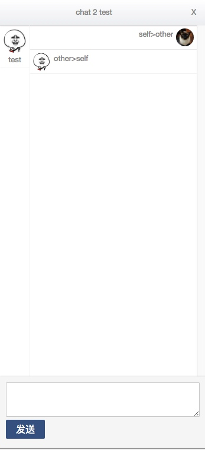

## websocket实时通讯解决
### 简介:


采用websocket实现，具有历史消息记录、未读消息、最近联系等功能.
### html层
```
<div class="chat-container">
   <div class="chat">
       <div class="chat-header">
           <a href="#blank" class="chat-title">Chat 2 'jmpews'</a> <a href="#blank" class="chat-close">X</a>
       </div>
       <div class="chat-content">
           <div class="chat-user-all">
               <div class="chat-user">
                   test
               </div>
               <div class="chat-user">
                   test
               </div>
               <div class="chat-user">
                   test
               </div>
           </div>
           <ul>
               <li class="chat-other cl">
                   
                   <div class="chat-text">
                       hello jmpews....
                   </div>
               </li>
               <li class="chat-self cl">
                   
                   <div class="chat-text">
                       hello jmpews....
                   </div>
               </li>
           </ul>
       </div>
       <div class="chat-footer">
           <form class="form-group row">
               <textarea class="form-control" cols="2"></textarea>
               <button type="submit" class="btn btn-primary col-sm-2">发送</button>
           </form>
       </div>
   </div>
</div>
```

### js层
```
// 启动聊天的websocket
function start_chat_websocket(url) {
    var wsServer = 'ws://' + url + '/user/chatwebsocket';
    chat_websocket = new WebSocket(wsServer);
    chat_websocket.onopen = function (evt) {
        onOpen(evt)
    };
    chat_websocket.onclose = function (evt) {
        onClose(evt)
    };
    chat_websocket.onmessage = function (evt) {
        onMessage(evt)
    };
    chat_websocket.onerror = function (evt) {
        onError(evt)
    };

    function onOpen(evt) {
        console.log("Connected to WebSocket server.");
        // 请求更新 最近用户列表
        send_socket_message('update_recent_user_list', '')
    }

    function onClose(evt) {
        console.log("Disconnected");
    }

    function onMessage(evt) {
        var result = JSON.parse(evt.data);
        console.log(result);
        if (result.errorcode == 0) {
            handle_receive_message(result.data);
        }
    }

    function onError(evt) {
        console.log('Error occured: ' + evt.data);
    }
}

// 发送操作码和数据
function send_socket_message(opt, data) {
    if (data == '')
        data = 'x';
    var message = JSON.stringify({
        'opt': opt,
        'data': data
    });
    chat_websocket.send(message);
}

// 设置当前聊天用户
function set_current_user(user_id) {
    window.sessionStorage.setItem('current_user_id', user_id);

}

// 判断是否为当前用户
function is_current_user(user_id) {
    var curent_user_id = window.sessionStorage.getItem('current_user_id');
    if (curent_user_id) {
        if (curent_user_id == user_id) {
            return true
        }
    }
    return false;
}

// 判断 最近用户列表是否存在
function is_current_user_list(user_id) {
    var recent_user_list = window.sessionStorage.getItem('recent_user_list');
    if (recent_user_list) {
        recent_user_list = JSON.parse(recent_user_list);
    }
    else
        return false;
    var user_id_list = recent_user_list.user_id_list;
    if(user_id_list) {
        if(user_id_list.indexOf(user_id)!= -1)
            return true;
    }
    return false;
}

// 把消息添加到消息列表的html中
function append_message_to_chat_content(message) {
    if (message[0] == "<")
        var s = "<li class='chat-other cl'><div class='chat-text'>" + message[1] + "</div></li>";
    else
        var s = "<li class='chat-self cl'><div class='chat-text'>" + message[1] + "</div></li>";

    $('.chat .chat-content ul').append(s);
}
function append_tmp_user_to_user_list(other_id, other_name, other_avatar) {
    $('.chat-user-all').append("<div class='chat-user' other='" + other_id + "'><span class='chat-user-name'>" + other_name + "</span></div>")
    // 点击用户头像, 初始化,与该用户的聊天记录窗口
    $('.chat-user').on('click', function (e) {
        var other_id = $(e.currentTarget).attr('other');
        set_current_user(other_id);
        send_socket_message('recent_chat_message', {'user_id': other_id})
    });
}
// 打开聊天页面
$('.real-time-chat').on('click', function () {
    $('.no-recent-user-list').show();
    send_socket_message('update_recent_user_list_and_open', '');
});

// 更新用户列表
function generate_chat_user_list() {
    var recent_user_list = window.sessionStorage.getItem('recent_user_list');
    if (recent_user_list) {
        recent_user_list = JSON.parse(recent_user_list);
    }
    else {
        send_socket_message('update_recent_user_list', '');
        return;
    }
    $('.chat-user-all').html('');
    for (var i = 0; i < recent_user_list.user_id_list.length; i++) {
        var user_id = recent_user_list.user_id_list[i];
        var other_id = recent_user_list[user_id].other_id;
        var other_avatar = recent_user_list[user_id].other_avatar;
        var other_name = recent_user_list[user_id].other_name;
        $('.chat-user-all').append("<div class='chat-user' other='" + other_id + "'><span class='chat-user-name'>" + other_name + "</span></div>")
    }
    // 点击用户头像, 初始化,与该用户的聊天记录窗口
    $('.chat-user').on('click', function (e) {
        var other_id = $(e.currentTarget).attr('other');
        set_current_user(other_id);
        send_socket_message('recent_chat_message', {'user_id': other_id})
    });
}

// 更新聊天记录窗口
function generate_chat_content_html(data) {
    debugger;
    $('.chat .chat-title').html('chat 2 ' + data['other_name']);
    $('.chat .chat-header').attr('other_avatar', data['other_avatar']);
    $('.chat .chat-header').attr('me_avatar', data['me_avatar']);
    $('.chat .chat-header').attr('other_id', data['other_id']);
    var recent_message = data['msg'];
    $('.chat .chat-content ul').html('');
    for (var i = 0; i < recent_message.length; i++) {
        if (recent_message[i][0] == "<")
            var s = "<li class='chat-other cl'><div class='chat-text'>" + recent_message[i][1] + "</div></li>";
        else
            var s = "<li class='chat-self cl'><div class='chat-text'>" + recent_message[i][1] + "</div></li>";
        $('.chat .chat-content ul').append(s);
    }
    $('.chat-container').show()
}

// 根据操作码,处理接收到的消息数据
function handle_receive_message(data) {
    // 更细最近用户列表
    if (data.code == 'update_recent_user_list') {
        window.sessionStorage.setItem('recent_user_list', JSON.stringify(data));
        generate_chat_user_list();
    }
    else if (data.code == 'update_recent_user_list_and_open') {
        window.sessionStorage.setItem('recent_user_list', JSON.stringify(data));
        generate_chat_user_list();
        $('.chat-container').show()
    }
    // 处理消息数据
    else if (data.code == 'receive_message') {
        debugger;
        // 判断是否为当前用户
        if (!is_current_user(data.other_id)) {
            // 如果不是当前用户更新 用户最近列表的未读消息数
            send_socket_message('update_recent_user_list', '');
        }
        else {
            // 如果是当前用户 append到当前聊天内容中
            append_message_to_chat_content(data.msg);
            generate_chat_user_list();
        }
    }
    else if (data.code == 'recent_chat_message') {
        generate_chat_content_html(data);
        if(!is_current_user_list(data.other_id)) {
            append_tmp_user_to_user_list(data.other_id, data.other_name, data.other_avatar);
        }
    }
}
```
### 服务端层
#### DB层
```
class ChatMessage(BaseModel):
    """
    A,B,C 都给D发送消息。 D有三种状态。 1. D在线 2. D不在线 3。 断线后重新连接

    对于D,需要针对这三种情况做处理
    """
    sender = ForeignKeyField(User, related_name='sender')
    receiver = ForeignKeyField(User, related_name='receiver')
    content = TextField(verbose_name='chat-content')
    is_read = BooleanField(default=False)
    time = DateTimeField(default=datetime.datetime.now)

    @staticmethod
    def get_recent_chat_message(current_user, other):
        '''
        获取双方对话的聊天记录
        :param userA:
        :param userB:
        :return:
        '''
        result = {}
        result['me_name'] = current_user.username
        result['me_avatar'] = current_user.avatar
        result['other_name'] = other.username
        result['other_id'] = other.id
        result['other_avatar'] = other.avatar
        result['unread_msg'] = ChatMessage.get_unread_message(current_user, other)
        result['msg'] = []
        # import pdb;pdb.set_trace()

        # () 注意需要全包
        recent_messages = (ChatMessage.select().where(((ChatMessage.sender == current_user) & (ChatMessage.receiver == other)) | ((ChatMessage.sender == other) & (ChatMessage.receiver == current_user))).order_by(ChatMessage.time).limit(10))
        for msg in recent_messages:
            d = '>' if msg.sender == current_user else '<'
            result['msg'].append([d, msg.content, TimeUtil.datetime_delta(msg.time)])
            result['update_time'] = str(msg.time)
        return result

    @staticmethod
    def get_unread_message(current_user, other):
        tmp = []
        unread_messages = ChatMessage.select().where(ChatMessage.receiver == current_user, ChatMessage.sender==other, ChatMessage.is_read == False).order_by(ChatMessage.time)
        for msg in unread_messages:
            tmp.append(['<',msg.content, TimeUtil.datetime_delta(msg.time)])
        return tmp

    @staticmethod
    def get_recent_user_list(current_user):
        '''
        获取所有未读的消息(都是发送给我的)
        :param me:
        :return:
        '''
        recent_user_list = {}

        user_id_list = []
        recent_user_list['user_id_list'] = user_id_list
        recent_message = ChatMessage.select().where(ChatMessage.receiver == current_user, ChatMessage.is_read == False).order_by(ChatMessage.time)
        for msg in recent_message:
            sender = msg.sender
            if sender.id not in recent_user_list.keys():
                user_id_list.append(sender.id)
                recent_user_list[sender.id]={}
                recent_user_list[sender.id]['other_name'] = sender.username
                recent_user_list[sender.id]['other_id'] = sender.id
                recent_user_list[sender.id]['other_avatar'] = sender.avatar
                recent_user_list[sender.id]['msg'] = []
            recent_user_list[sender.id]['msg'].append(['<', msg.content, TimeUtil.datetime_delta(msg.time)])
            recent_user_list[sender.id]['update_time'] = str(msg.time)
        recent_user_list['user_id_list'] = user_id_list
        return recent_user_list

```

#### web逻辑层
```
class WebsocketChatHandler(BaseWebsocketHandler):
    """
    使用websocket的实时聊天

    websocket real-time-chat
    """

    # redis ?
    clients = {}

    def check_origin(self, origin):
        return True

    @ppeewwee
    def open(self, *args, **kwargs):
        user = self.current_user
        if user and  user.username not in WebsocketChatHandler.clients.keys():
            WebsocketChatHandler.clients[user.username] = self
            # self.write_message(json_result(2,ChatMessage.get_not_read_log(user)))

    @ppeewwee
    def on_close(self):
        user = self.current_user

        if user.username in WebsocketChatHandler.clients.keys():
            WebsocketChatHandler.clients.pop(user.username)
        else:
            logger.debug("[{0}] not in Websocket.clients, but close.".format(user.username))

    @staticmethod
    def is_online(username):
        w = WebsocketChatHandler.clients.get(username, False)
        return w

    @ppeewwee
    def on_message(self, message):
        json_data = get_cleaned_json_data_websocket(message, ['opt', 'data'])
        data = json_data['data']
        opt = json_data['opt']

        if opt == 'update_recent_user_list':
            current_user_list = ChatMessage.get_recent_user_list(self.current_user)
            current_user_list['code'] = 'update_recent_user_list'
            self.write_message(json_result(0,current_user_list))

        elif opt == 'update_recent_user_list_and_open':
            current_user_list = ChatMessage.get_recent_user_list(self.current_user)
            current_user_list['code'] = 'update_recent_user_list_and_open'
            self.write_message(json_result(0,current_user_list))

        elif opt == 'send_message':
            other_id = data['user_id']
            other = User.get(User.id == other_id)
            content = data['content']
            cl = ChatMessage.create(sender=self.current_user, receiver=other, content=content)
            other_websocket = WebsocketChatHandler.is_online(other.username)
            self.write_message(json_result(0, {'code': 'receive_message',
                                                      'other_id': other.id,
                                                      'msg': ['>', cl.content, TimeUtil.datetime_delta(cl.time)]}))

            other_websocket.write_message(json_result(0, {'code': 'receive_message',
                                                      'other_id': self.current_user.id,
                                                      'msg': ['<', cl.content, TimeUtil.datetime_delta(cl.time)]}))
        elif opt == 'recent_chat_message':
            other_id = data['user_id']
            other = User.get(User.id == other_id)

            recent_message = ChatMessage.get_recent_chat_message(self.current_user, other)
            recent_message['code'] = 'recent_chat_message'
            self.write_message(json_result(0,recent_message))
```


